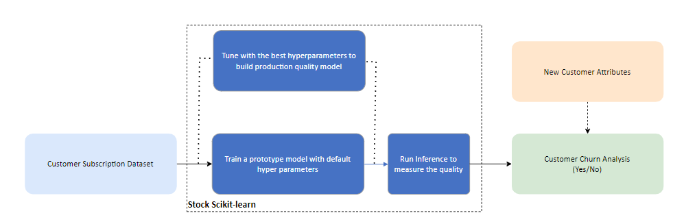
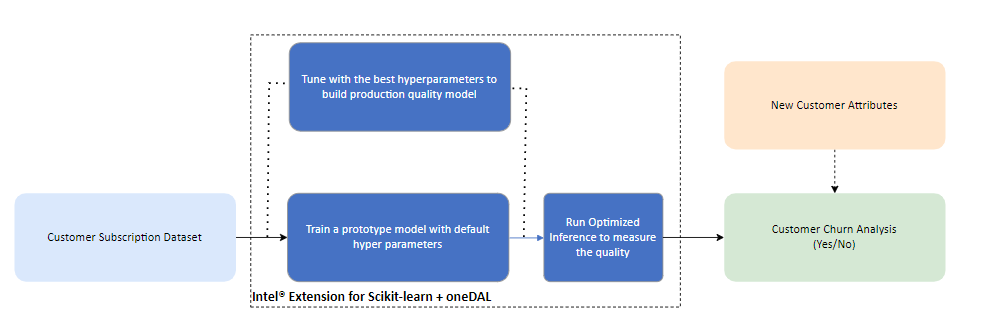
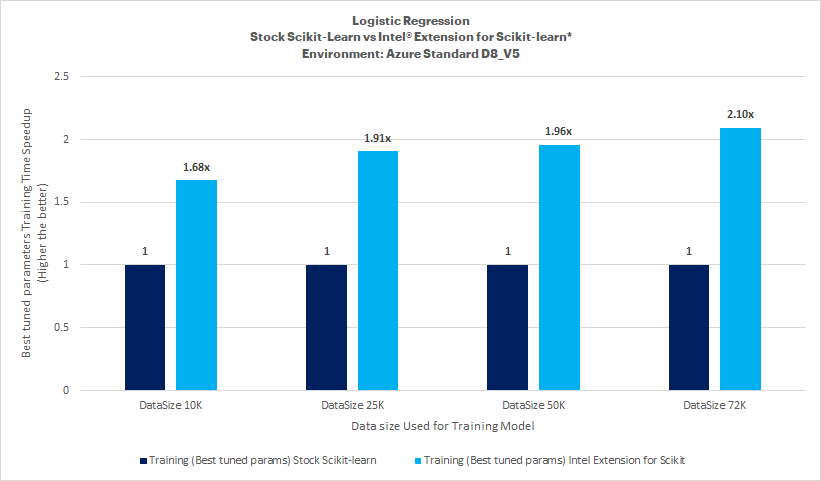
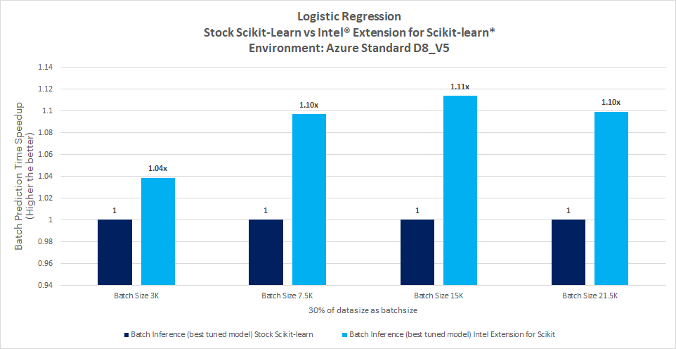
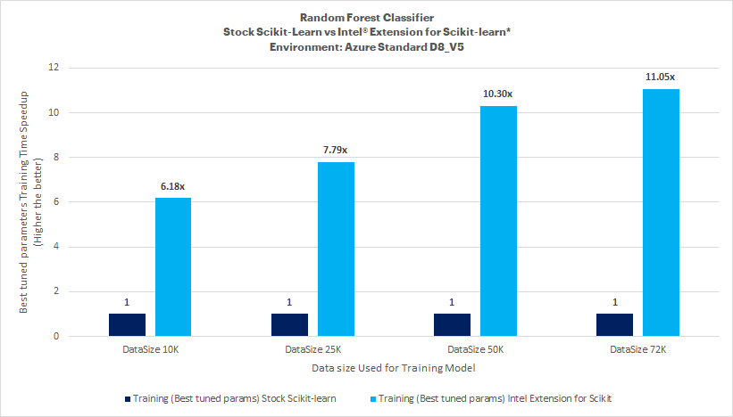
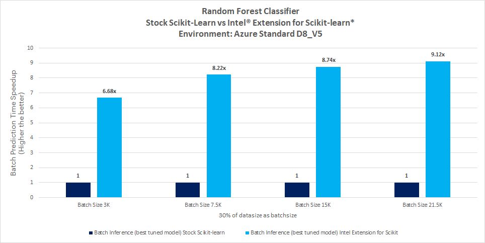

# **Scikit-Learn Customer Churn Prediction**
<!-- Table of Contents -->
## Table of Contents
- [Purpose](#purpose)
- [Reference Solution](#reference-solution)
- [Reference Implementation](#reference-implementation)
- [Intel® Implementation](#optimizing-the-e2e-solution-with-intel®-oneapi)
- [Performance Observations](#performance-observations)

## Purpose
For Telecommunication companies, it is key to attract new customers and at the same time avoid contract terminations (=churn) to grow their revenue-generating base. Looking at churn, different reasons trigger customers to terminate their contracts, for example, better prices, more interesting packages, bad service experiences, or changes in customers’ personal situations. Churn analytics provides valuable capabilities to predict customer churn in real-time, whenever customers interaction take place or in batch, using multiple events generated by the customers’ interactions. Organizations can take decisions based on churn prediction to proactively provide suitable compensation offers or take corrective service improvement actions to reduce the churn.

In this reference kit, we demonstrate a reference implementation for predicting the customer churn status which can be part of the overall customer service improvement system.

## Reference Solution
Based on the previous customer churn history along with their service subscription details, a ML model is built to predict whether the customer is going to churn. In this reference kit, since this is a classification problem, we are exploring two different approaches of solving it as given below and find out the best among them.
- Probabilistic approach using Logistic Regression algorithm
- Decision tree approach using Random Forest algorithm

> Above algorithm has been picked up as an example for the appropriate approaches

We also focus on below critical factors for the efficient solution
- Faster model development and 
- Performance-efficient model inference

<!-- Key Implementation Details -->
### Key Implementation Details
This section describes the code base and how to replicate the benchmarking results. The included code demonstrates a complete framework for
1. Setting up a virtual environment for stock Scikit-Learn and Intel® Extension for Scikit-learn*
2. Training a Logistic regression based Churn Prediction Model for predicting customer churn using stock version of SciKit-Learn and Intel® Extension for Scikit-learn*
3. Training a Random Forest classifier based Churn Prediction Model for predicting customer churn using stock version of SciKit-Learn and Intel® Extension for Scikit-learn*
4. Predicting the customer churn from the trained models on new data using Scikit-Learn/Intel® Extension for Scikit-learn*

## Reference Implementation
**Use case E2E flow**




**Reference Sources**

Model Training: https://www.kaggle.com/code/edwingeevarughese/internet-service-churn-analysis

### Note:
***Please see this data set's applicable license for terms and conditions. Intel®Corporation does not own the rights to this data set and does not confer any rights to it.***

### Repository clone and Anaconda installation

```
git clone https://github.com/oneapi-src/customer-churn-prediction
cd customer-churn-prediction
```
**Anaconda Installation**

>**Note**: This reference kit implementation already provides the necessary conda environment configurations to set up the software requirements. To utilize these environment scripts, first, install Anaconda/Miniconda by following the instructions at the following link<br>[Anaconda installation](https://docs.anaconda.com/anaconda/install/linux/)

**Dataset Details**

<!-- Dataset Details -->
Dataset used in this reference kit is taken from [Kaggle](https://www.kaggle.com/datasets/mehmetsabrikunt/internet-service-churn)
> *Please see this data set's applicable license for terms and conditions. Intel does not own the rights to this data set and does not confer any rights to it.*

Each row in the data set represents a customer and contains below features of the customer
- `ID` Customer Unique Identification Number
- `is_tv_subscriber` customer has a tv subscription (1,0)
- `is_movie_package_subscriber` Wis he/she has a cinema movie package subs (1,0)
- `subscription_age` how many years has the customer used our service
- `bill_avg` last 3 months bill avg
- `reamining_contract` how many years remaining for the customer contract. if null; the customer hasn't had a contract. the customer who has a contract time
- `service_failure_count` customer call count to call center for service failure for last 3 months
- `download_avg` last 3 months internet usage (in GigaBytes)
- `upload_avg` last 3 months upload avg (in GigaBytes)
- `download_over_limit` most customer has a download limit. if they reach this limit they have to pay for this. this column contains "limit over
- `Churn` Whether the customer churned or not (Yes or No)


Based on these features and previous known churn history a model is built to predict the churn of the customer for the below scenario
- Predict the churn in batch mode (on demand for proactive service offers, to check customer satisfaction and improve services)

The dataset consisted of structured Telecomm internet subscriber Data for 72275 customers and 10 features against each customer as described above. 4 categorical features and 6 numerical features. Based on these features we are required to predict churn = Yes/No.


**Dataset Installation**

Once the repo is cloned, follow the below commands to install the dataset described previously for your environment.
1. Go to the [Kaggle](https://www.kaggle.com/datasets/mehmetsabrikunt/internet-service-churn)link.
2. Download the dataset, and click on the download button(782kB).
3. Unzip the data folder to get the .csv file. 
4. Move the .csv file inside the "data" folder inside the oneAPI-CustomerChurnPrediction-SciKit repository.


**Solution Setup**

Follow the below conda installation commands to set up the Stock environment along with the necessary packages for this model training and prediction.
>**Note: It is assumed that the present working directory is the root directory of this code repository**

```
conda env create --file env/stock/stock-churn-prediction.yml
```
*Activate conda environment for stock version*
Use the following command to activate the environment that was created:
```
conda activate stock-churn-prediction
```
**Software Requirements**
| **Package**                | **Version**
| :---                       | :---
| python                     | 3.9.13
| scikit-learn               | 1.1.3


**Solution Implementation**
***Hyperparameter tuning***
*Random Forest Classifier Algorithm Parameters Considered*
| **Parameter** | **Description** | **Values**
| :---          | :---            | :---
| **n_estimators** | The number of trees in the forest. | **100, 150**
| **max_leaf_nodes** | Grow trees with max_leaf_nodes in best-first fashion. Best nodes are defined as relative reduction in impurity. If None then unlimited number of leaf nodes. | **15, 30, 45**
| **maxdepth** | The maximum depth of the tree. If None, then nodes are expanded until all leaves are pure or until all leaves contain less than min_samples_split samples. | **None, 4, 5**

*Logistic Regression Algorithm Parameters Considered*
| **Parameter** | **Description** | **Values**
| :---          | :---            | :---
| **fit_intercept** | Specifies if a constant (a.k.a. bias or intercept) should be added to the decision function. | **True,False**

*GridSearchCV*
It is used to apply fit method to train and optimize by cross-validated grid-search over a parameter grid.

*Parameters Considered for GridSearchCV*
| **Parameter** | **Description**
| :-- | :--
| `n_jobs` | Number of jobs to run in parallel. None means 1 unless in a joblib.parallel_backend context. -1 means using all available processors.
| `param_grid` | Dictionary with parameters names (str) as keys and lists of parameter settings to try as values.
| `cv` | Determines the cross-validation splitting strategy

<!-- Benchmarking Details -->
**Benchmarking Details**

Below is the summary of benchmarking that are performed in this experiment
- One of the important aspects in this enterprise scenario is to improve the MLOps time for developing and deploying new models due to its ever-increasing size of datasets over a period. To address this, the use of Intel® Extension for Scikit-learn optimized Logistic Regression and Random Forest Classifier algorithms are explored. The training and prediction time of models are benchmarked over stock version of Scikit-Learn python package.


**Model Building Process**

The training.py script **reads and preprocesses the data**, **trains an RFC and LR model**, and inference.py script **predicts on unseen test data** using the trained model, while also reporting on the execution time.

The usage of the training benchmark script is as given below
```sh
usage: training.py [-h] [-s DATASIZE] [-hy HYPERPARAMS] [-tr TRAINING] [-b BATCHSIZE] [-i INTEL] [-ts TESTSPLIT] [-model MODELNAME] [-save SAVEMODELDIR]

optional arguments:
  -h, --help            show this help message and exit
  -s DATASIZE, --datasize DATASIZE
                        Dataset size, default is full dataset
  -hy HYPERPARAMS, --hyperparams HYPERPARAMS
                        Enabling Hyperparameter tuning (0/1)
  -tr TRAINING, --training TRAINING
                        Enabling training (0/1)
  -b BATCHSIZE, --batchsize BATCHSIZE
                        Enabling inference (0/1)
  -i INTEL, --intel INTEL
                        Use intel accelerated technologies where available (0/1)
  -ts TESTSPLIT, --testsplit TESTSPLIT
                        Percentage of test split from the total dataset (default is 20) Remaining percentage will be used as Training dataset split (default is 80)
  -model MODELNAME, --modelname MODELNAME
                        Default is 'random_forest_classifier'
  -save SAVEMODELDIR, --savemodeldir SAVEMODELDIR
                        Please specify model path along with model name to save Default is 'models/customerchurn_rfc_joblib'
```

To run the script with stock python and stock technologies on full dataset:
```sh
#For Training with Random Forest Classifier default hyperparameters
python src/training.py -model random_forest_classifier -tr 1 -save models/customerchurn_rfc_joblib
#For Training with Logistic Regression default hyperparameters
python src/training.py -model logistic_regression -tr 1 -save models/customerchurn_lr_joblib


#For Hyperparameter tuning using Random Forest Classifier
python src/training.py -model random_forest_classifier -tr 1 -hy 1 -save models/customerchurn_rfc_joblib
#For Hyperparameter tuning using Logistic Regression
python src/training.py -model logistic_regression -tr 1 -hy 1 -save models/customerchurn_lr_joblib
```
>Note: By supplying the "-s 10000" (example for utilizing 10K samples) option, users can execute training and hyperparameter tuning benchmarks on a subset of the dataset. By default, training is performed on the whole dataset.

>Note: For above default parameters training mode, model will be saved with an extension of "_default" to the provided path (-save)

The hyperparameter tuning will save the best estimator model for both algorithms under `models` directory with the below file names for every run
`models/customerchurn_rfc_joblib` - Random Forest Classifier model
`models/customerchurn_lr_joblib` - Logistic Regression model

The saved model can then be passed to the inference benchmarking script to perform the prediction as given below for the given dataset

**Running Predictions**
The usage of the inference benchmark script is as given below
```sh
usage: inference.py [-h] [-s DATASIZE] [-b BATCHSIZE] [-i INTEL] [-model MODELNAME] [-save SAVED_MODEL_DIR] [-ts TESTSPLIT]

optional arguments:
  -h, --help            show this help message and exit
  -s DATASIZE, --datasize DATASIZE
                        Dataset size, default is full dataset
  -b BATCHSIZE, --batchsize BATCHSIZE
                        Enabling inference (0/1)
  -i INTEL, --intel INTEL
                        Use intel accelerated technologies where available (0/1)
  -model MODELNAME, --modelname MODELNAME
                        Default is 'random_forest_classifier'
  -save SAVED_MODEL_DIR, --saved_model_dir SAVED_MODEL_DIR
                        Please specify model path along with model name to save Default is 'models/customerchurn_rfc_joblib'
  -ts TESTSPLIT, --testsplit TESTSPLIT
                        Percentage of test split from the total dataset (default is 20) Remaining percentage will be used as Training dataset split (default is 80)
```

```sh
#For Inferencing using Random Forest Classifier
python src/inference.py -model random_forest_classifier --saved_model_dir models/customerchurn_rfc_joblib -b 3000
#For Inferencing using Logistic Regression
python src/inference.py -model logistic_regression --saved_model_dir models/customerchurn_lr_joblib -b 3000
```
>Note: 20% of datasize is used as batchsize for benchmarking batch prediction (Stock Scikit-learn models used here for inference)

>Note: The model trained on 72K dataset with best-tuned parameters is used for performing inference across different batch sizes.

>Note: If the inference batch size is greater than 20% of the total data size, the test dataset accuracy computation will be done on training samples, which is not typical practice but is utilized here to mimic bigger batchsize. Accuracy must be disregarded in this case.

## Optimizing the E2E solution with Intel® oneAPI

**Optimized E2E use case flow with Intel® oneAPI components**



**Optimized Software Components**

***Intel® oneAPI Extension for Scikit*** Designed for data scientists, Intel® Extension for Scikit-learn* is a seamless way to speed up your Scikit-learn applications for machine learning to solve real-world problems. This extension package dynamically patches Scikit-learn estimators to use Intel® oneAPI Data Analytics Library (oneDAL) as the underlying solver, while achieving the speed up for your machine learning algorithms.

**Software Requirements**
| **Package**                | **Version**
| :---                       | :---
| Intel python               | 3.9.13 - 2022.0.0
| scikit-learn               | 1.1.3
| scikit-learn-intelex       | 2021.7.1

**Optimized Solution Setup**

Follow the below conda installation commands to set up the Stock environment along with the necessary packages for this model training and prediction.
>**Note: It is assumed that the present working directory is the root directory of this code repository**

```sh
conda env create --file env/intel/intel-churn-prediction.yml
```
*Activate conda environment for intel version*
Use the following command to activate the environment that was created:
```sh
conda activate intel-churn-prediction
```

**Optimized Solution Implementation**

***Model building process with Intel® Optimization***

To run the script with intel optimized python distribution on full dataset:
```sh
#For Training with Random Forest Classifier default hyperparameters
python src/training.py -i 1 -model random_forest_classifier -tr 1 -save models/customerchurn_rfc_joblib
#For Training with Logistic Regression default hyperparameters
python src/training.py -i 1 -model logistic_regression -tr 1 -save models/customerchurn_lr_joblib


#For Hyper parameter tuning using Random Forest Classifier
python src/training.py -i 1 -model random_forest_classifier -tr 1 -hy 1 -save models/customerchurn_rfc_joblib
#For Hyper parameter tuning using Logistic Regression
python src/training.py -i 1 -model logistic_regression -tr 1 -hy 1 -save models/customerchurn_lr_joblib
```
>Note: By supplying the "-s 10000" (example for utilizing 10K samples) option, users can execute training and hyperparameter tuning benchmarks on a subset of the dataset. By default, training is performed on the whole dataset.

The saved optimized model can then be passed to the benchmarking script to perform the prediction as given below
```sh
#For Inferencing using Random Forest Classifier
python src/inference.py --i 1 -model random_forest_classifier --saved_model_dir models/customerchurn_rfc_joblib -b 3000
#For Inferencing using Logistic Regression
python src/inference.py --i 1 -model logistic_regression --saved_model_dir models/customerchurn_lr_joblib -b 3000
```
>Note: 20% of datasize is used as batchsize for benchmarking batch prediction (Intel® Extension for Scikit-learn* models used here for inference)

>Note: The model trained on 72K dataset with best-tuned parameters is used for performing inference across different batch sizes.

>Note: If the inference batch size is greater than 20% of the total data size, the test dataset accuracy computation will be done on training samples, which is not typical practice but is utilized here to mimic bigger batchsize. Accuracy must be disregarded in this case.

## Performance Observations
### Algorithm: Logistic Regression
***Best Hyperparameter Training***<br>

<br>**Key Takeaways**<br>Intel® Extension for Scikit-learn* for the Logistic Regression model offers training time speed-up ranging between 1.68x and 2.10x compared to stock Scikit-learn with tuned hyperparameters on this dataset.

***Inference Results***<br>

<br>**Key Takeaways**<br>

**Prediction**
- Intel® Extension for Scikit-learn* offers batch prediction time speed-up up to 1.11x compared to stock Scikit-learn with Logistic Regression on hyperparameter tuned model.
> No accuracy drop observed

### Algorithm: Random Forest Classifier
***Best Hyperparameter Training***<br>

<br>**Key Takeaways**<br>Intel® Extension for Scikit-learn* for the Random Forest Classifier model offers a training time speed-up of up to 11.05x compared to stock Scikit-learn with tuned hyperparameters on this dataset.

***Inference Results***<br>

<br>**Key Takeaways**<br>

**Prediction**
- Intel® Extension for Scikit-learn* offers batch prediction time speed-up of up to 9.12x compared to stock Scikit-learn with Random Forest Classifier on hyperparameter tuned model.

#### Conclusion
To build a customer churn prediction solution at scale, Data scientists will need to train models for substantial datasets and run inference more frequently. The ability to accelerate training will allow them to train more frequently and achieve better accuracy. Besides training, faster speed in inference will allow them to run predictions in real-time scenarios as well as more frequently. A Data Scientist will also look at data classification to tag and categorize data so that it can be better understood and analyzed. This task requires a lot of training and retraining, making the job tedious. The ability to get it faster speed will accelerate the ML pipeline.
Considering the customer churn prediction problem, the key factor to decide on the above two algorithms is to measure the recall value of the model correctly identifying the churn. 

This reference kit implementation provides a performance-optimized guide around customer churn prediction use cases that can be easily scaled across similar use cases.

The recall value of incorrectly identifying the churn prediction is not a major factor, as it will still help reduce the churn. As per the default dataset size, it has been observed that Logistic regression recall value for correctly identifying the churn is on higher side compared to Random Forest Classifier, which would be the opt one for this kind of problem.

### Notices & Disclaimers
Performance varies by use, configuration and other factors. Learn more on the [Performance Index site](https://edc.intel.com/content/www/us/en/products/performance/benchmarks/overview/). 
Performance results are based on testing as of dates shown in configurations and may not reflect all publicly available updates.  See backup for configuration details.  No product or component can be absolutely secure. 
Your costs and results may vary. 
Intel technologies may require enabled hardware, software or service activation.
© Intel Corporation.  Intel, the Intel logo, and other Intel marks are trademarks of Intel Corporation or its subsidiaries.  Other names and brands may be claimed as the property of others.  

## Appendix

**Date Testing Performed**: November 2022 

**Configuration Details and Workload Setup**: Azure D8v5 (Intel® Xeon® Platinum 8370C CPU @ 2.80GHz), 1 Socket, 4 Cores per Socket, 2 Threads per Core, Turbo: On, Total Memory: 32 GB, OS: Ubuntu 20.04, Kernel: Linux 5.15.0-1019-azure. Framework/Toolkit: Intel® oneAPI Extension for Scikit, Python -v3.9.13. Dataset size: 72275 customers and 10 features. Model: RandomForestClassifier and Logistic Regression. Batch size for prediction time benchmark: 20% of train data size. Precision: FP32. 

**Testing performed by** Intel Corporation

**Accuracy Observations**

Accuracy of RandomForestClassifier is upto 97%.

Accuracy of Logistic Regression is upto 82%.

**Experiment Setup**
| Platform                          | Microsoft Azure: Standard_D8_v5 (Ice Lake)<br>Ubuntu 20.04
| :---                              | :---
| Hardware                          | Intel IceLake CPU
| Software                          | Intel® oneAPI AI Analytics Toolkit, scikit-Learn
| What you will learn               | Intel oneAPI performance advantage over the stock versions
